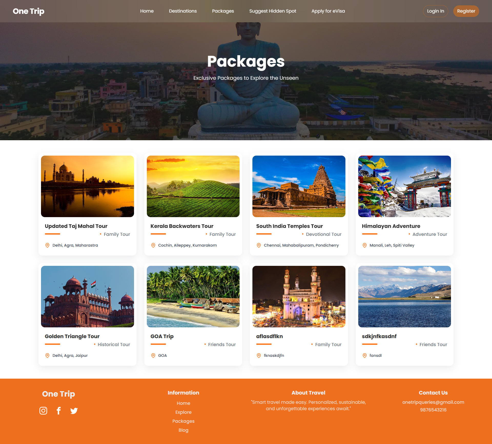
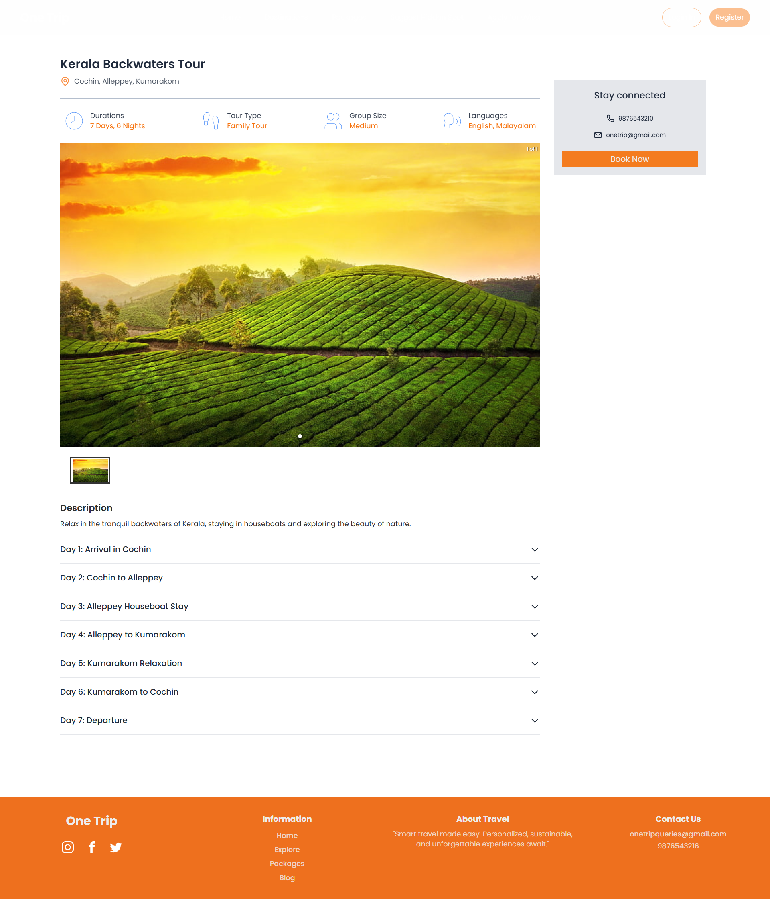
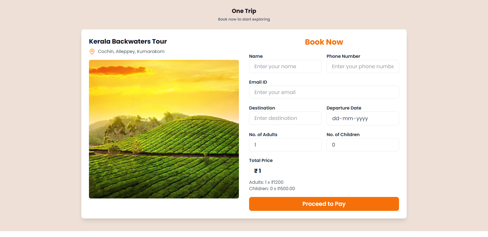

# One Trip Client (Frontend)

The **One Trip Platform** is a responsive web application that enhances the travel experience by providing a unified platform for planning trips. It integrates real-time data to offer tourists a seamless and intelligent way to explore destinations.

---

## Demo

---

## Project Overview

In an era of digital transformation, tourism lacks a unified system for personalized planning. The Smart Tourism Platform addresses this by combining AI, real-time data, and third-party APIs to create a comprehensive solution for tourists. The platform helps users discover hidden spots, customize travel packages, and make informed decisions based on reviews and recommendations.

---

### Key Objectives:

- Develop a user-friendly interface for travel planning.
- Integrate AI-driven chatbots for enhanced user engagement.
- Utilize real-time data for personalized experiences.
- Promote sustainable tourism practices.

---

## Features

- **Responsive Layout:** Adapts to various screen sizes and devices.
- **AI Chatbot:** Provides real-time assistance and recommendations.
- **Tourist Spot Discovery:** Highlights hidden attractions using geolocation.
- **Third-Party Integration:** Includes Google Maps and hotel booking APIs.
- **Sustainable Travel:** Encourages eco-friendly travel choices.

---

## Tech Stack

- **Frontend:** React JS, Tailwind CSS
- **Backend:** Node.js, Express.js
- **Database:** MongoDB
- **APIs:** Google Maps API, Booking APIs

---

## Usage

- **Explore Destinations:** Browse through various tourist destinations with detailed descriptions and images.
- **Book Accommodations:** Use the integrated booking system to reserve hotels and travel packages.
- **Chat with the Bot:** Interact with the AI-driven chatbot for assistance and recommendations.
- **Discover Hidden Spots:** Find unique attractions based on your location and preferences.
- **Engage with Local Businesses:** Explore and support local businesses featured on the platform.

---
